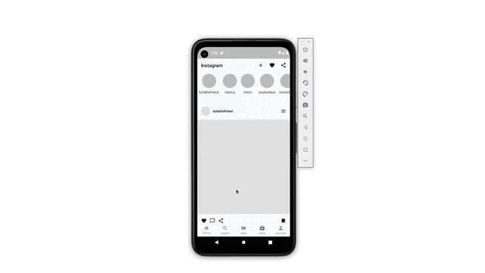

<h1 align="center">Aris Instagram</h1>

<br />
 
<p align="center">
  
  
</p>

<br />



## Getting Started

```dart
$ git clone https://github.com/ariscybertech/aris_instagram.git
$ flutter packages get
```
Run the application and enjoy :tada::relaxed:

<a href="https://www.buymeacoffee.com/ariscybertech"></a>

Instagram allows users to edit and upload photos and short videos through a mobile app. Users can add a caption to each of their posts and use hashtags and location-based geotags to index these posts and make them searchable by other users within the app. Each post by a user appears on their followers' Instagram feeds and can also be viewed by the public when tagged using hashtags or geotags. Users also have the option of making their profile private so that only their followers can view their posts.

As with other social networking platforms, Instagram users can like, comment on and bookmark others' posts, as well as send private messages to their friends via the Instagram Direct feature. Photos can be shared on one or several other social media sites -- including Twitter, Facebook and Tumblr -- with a single click.

Instagram is not only a tool for individuals, but also for businesses. The photo-sharing app offers companies the opportunity to start a free business account to promote their brand and products. Companies with business accounts have access to free engagement and impression metrics. According to Instagram's website, more than 1 million advertisers worldwide use Instagram to share their stories and drive business results. Additionally, 60% of people say they discover new products through the app.

- 🌱 I’m currently learning everything
     I’m looking to collaborate with other content creators
- 🥅 2021 Goals: Contribute more to Open Source projects
- ⚡ Fun fact: I love to draw and play guitar / drums

# Description

Instagram is a free, online photo-sharing application and social network platform that was acquired by Facebook in 2012. Instagram allows users to edit and upload photos and short videos through a mobile app.
Instagram was started in San Francisco by Kevin Systrom and Mike Krieger, who initially tried creating a platform similar to Foursquare but then turned their attention exclusively to photo sharing. The word Instagram is an amalgam of "instant camera" and "telegram."

The iOS app was released through the iTunes App Store on Oct. 6, 2010, and the Android app was released on April 3, 2012. The platform's popularity skyrocketed, with the company reporting more than 40 million active users just two years after launch. This caught the attention of Facebook, which officially purchased Instagram for $1 billion in the summer of 2012.
